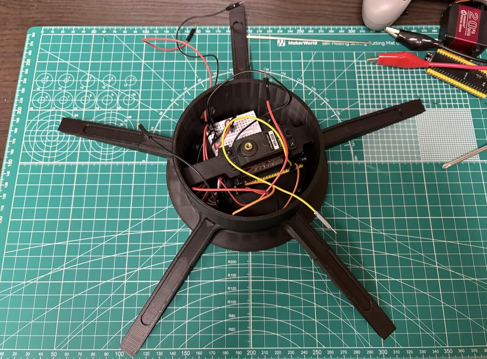
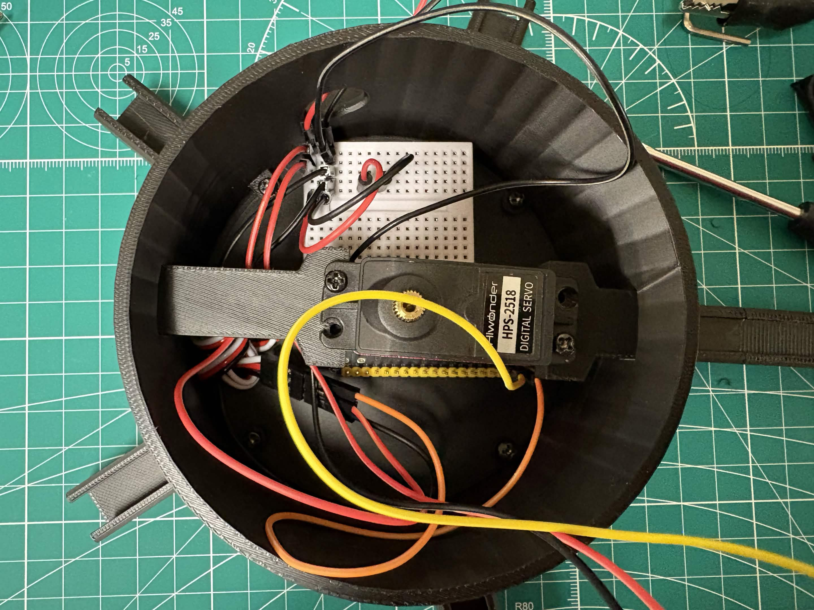

# ESP32RadioControlledArm (WIP)
A multi-joint robotic arm prototype controlled by an ESP32 microcontroller and external radio receiver input.
This project focuses on mechanical prototyping, servo control, and debugging real-world motion issues such as joint binding, torque limits, and power stability. The goal is to practice engineering workflow.

## Current Status

### Completed
- Base resdesign for better stability during rapid motor movements.

- Included some headroom for the esp32 inside the base to keep it fully enclosed.

### In Progress
- Redesigning shoulder joint to also include a bearing housing for smoother rotations.

## Hardware
- ESP32-S3
- 2x 25kg, 1x 20kg, 2 mid torque, 1 low torque servos
- External regulated 5V power supply
- Radio receiver (PWM channel output)
- Small breadboard and jumper wires
- 3D printed parts

## CAD Files
- `CAD/SolidWorks/` → SolidWorks source files
- `CAD/STEP/` → STEP to access parts without SW
- `CAD/STL/` → Printable parts